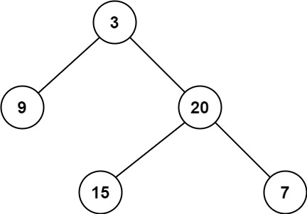

# 111-二叉树的最小深度

难度 简单


## 题目描述

给定一个二叉树，找出其最小深度。

最小深度是从根节点到最近叶子节点的最短路径上的节点数量。

说明：叶子节点是指没有子节点的节点。

示例 1：



```
输入：root = [3,9,20,null,null,15,7]
输出：2
```
示例 2：
```
输入：root = [2,null,3,null,4,null,5,null,6]
输出：5
```

提示：

- 树中节点数的范围在 `[0, 105]` 内
- `-1000 <= Node.val <= 1000`


## 思路

遍历整棵树，记录最小深度。

对于每一个非叶子节点，我们只需要分别计算其左右子树的最小叶子节点深度，当前节点的最小深度即为左右子树中深度较小的子树的深度+1。但要注意如果根节点的左或右子树为空的话是构不成子树的。而最小深度是要求从根节点到子树的。当左或右子树为空时，不符合要求。


## 代码

```c++
/**
 * Definition for a binary tree node.
 * struct TreeNode {
 *     int val;
 *     TreeNode *left;
 *     TreeNode *right;
 *     TreeNode() : val(0), left(nullptr), right(nullptr) {}
 *     TreeNode(int x) : val(x), left(nullptr), right(nullptr) {}
 *     TreeNode(int x, TreeNode *left, TreeNode *right) : val(x), left(left), right(right) {}
 * };
 */
class Solution {
public:
    int minDepth(TreeNode* root) {
        if (root == NULL) return 0;
        if (root->left == NULL && root->right == NULL) {
            return 1;
        }
        int left_depth = INT_MAX;
        int right_depth = INT_MAX;
        if (root->left) left_depth = minDepth(root->left);
        if (root->right) right_depth = minDepth(root->right);
        return min(left_depth, right_depth) + 1;
    }
};
```

