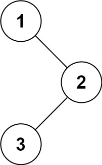

# 144-二叉树的前序遍历

难度 中等


## 题目描述

给你二叉树的根节点 *root* ，返回它节点值的 **前序** 遍历。

示例 1：



```
输入：root = [1,null,2,3]
输出：[1,2,3]
```
示例 2：

```
输入：root = []
输出：[]
```
示例 3：
```
输入：root = [1]
输出：[1]
```
示例 4：


```
输入：root = [1,2]
输出：[1,2]
```
示例 5：


```
输入：root = [1,null,2]
输出：[1,2]
```


提示：

- 树中节点数目在范围 `[0, 100]` 内
- `-100 <= Node.val <= 100`


进阶：**递归算法很简单，你可以通过迭代算法完成吗？**


## 思路

迭代算法： 首先创建一个栈用来存放节点，首先我们想要打印根节点的数据，此时栈里面的内容为空，所以我们优先将头结点加入栈，然后打印。

之后我们应该先打印左子树，然后右子树。所以先加入栈的就是右子树，然后左子树。


## 代码

```c++
/**
 * Definition for a binary tree node.
 * struct TreeNode {
 *     int val;
 *     TreeNode *left;
 *     TreeNode *right;
 *     TreeNode() : val(0), left(nullptr), right(nullptr) {}
 *     TreeNode(int x) : val(x), left(nullptr), right(nullptr) {}
 *     TreeNode(int x, TreeNode *left, TreeNode *right) : val(x), left(left), right(right) {}
 * };
 */
class Solution {
public:
    vector<int> preorderTraversal(TreeNode* root) {
        vector<int> res;
        if (root == nullptr) return res;
        stack<TreeNode*> s;
        s.push(root);
        while(!s.empty()) {
            TreeNode* node = s.top();
            res.push_back(node->val);
            s.pop();
            if (node->right) s.push(node->right);
            if (node->left) s.push(node->left);
        }
        return res;
    }
};
```

