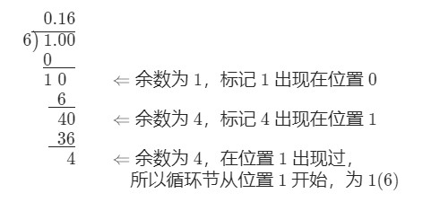

# 166-分数到小数

难度 中等


## 题目描述

给定两个整数，分别表示分数的分子 `numerator` 和分母 `denominator`，以 字符串形式返回小数 。

如果小数部分为循环小数，则将循环的部分括在括号内。

如果存在多个答案，只需返回 任意一个 。

对于所有给定的输入，保证 答案字符串的长度小于 `10^4` 。

示例 1：
```
输入：numerator = 1, denominator = 2
输出："0.5"
```
示例 2：
```
输入：numerator = 2, denominator = 1
输出："2"
```
示例 3：
```
输入：numerator = 2, denominator = 3
输出："0.(6)"
```
示例 4：
```
输入：numerator = 4, denominator = 333
输出："0.(012)"
```
示例 5：
```
输入：numerator = 1, denominator = 5
输出："0.2"
```


提示：

- `-2^31 <= numerator, denominator <= 2^31 - 1`
- `denominator != 0`


## 思路

核心思想是当余数出现循环的时候，对应的商也会循环。



需要用一个哈希表记录余数出现在小数部分的位置，当你发现已经出现的余数，就可以将重复出现的小数部分用括号括起来。

在除法过程中余数可能为 0，意味着不会出现循环小数，立刻停止程序。

需要考虑结果为负的情况，以及用long long来重新存储两个数字的绝对值（-2147483648的绝对值无法用int存储）。


## 代码

```c++
class Solution {
public:
    string fractionToDecimal(int numerator, int denominator) {
        string res;
        map<int, int> m;
        if ((numerator < 0 && denominator > 0) || (numerator > 0 && denominator < 0)) {
            res += "-";
        }
        long long numerator_long = abs(numerator);
        long long denominator_long = abs(denominator);
        long long quot = numerator_long / denominator_long;
        res += to_string(quot);
        long long leftover = numerator_long % denominator_long;
        if (leftover == 0) return res;
        res += '.';
        string res_dec;
        int loop = 0;
        m[leftover] = loop;
        loop++;
        while (1) {
            leftover = leftover * 10;
            quot = leftover / denominator_long;
            leftover = leftover % denominator_long;
            res_dec += to_string(quot);
            if (m.find(leftover) != m.end()) break;
            if (leftover == 0) return res + res_dec;
            m[leftover] = loop;
            loop++;
        }
        string res_dec_non_loop = res_dec.substr(0, m[leftover]);
        string res_dec_loop = res_dec.substr(m[leftover], res_dec.size() - m[leftover] + 1);
        return res + res_dec_non_loop + '(' + res_dec_loop + ')';
    }
};
```

