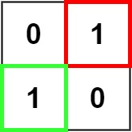
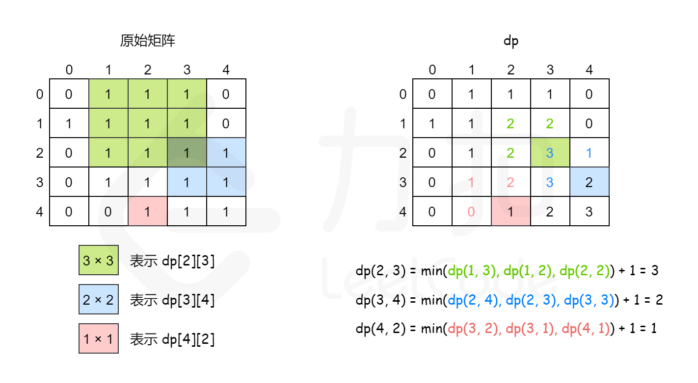

# 221-最大正方形

难度 中等


## 题目描述

在一个由 `'0'` 和 `'1'` 组成的二维矩阵内，找到只包含 `'1'` 的最大正方形，并返回其面积。

示例 1：


```
输入：matrix = [["1","0","1","0","0"],["1","0","1","1","1"],["1","1","1","1","1"],["1","0","0","1","0"]]
输出：4
```
示例 2：



```
输入：matrix = [["0","1"],["1","0"]]
输出：1
```
示例 3：
```
输入：matrix = [["0"]]
输出：0
```

提示：

- `m == matrix.length`
- `n == matrix[i].length`
- `1 <= m, n <= 300`
- `matrix[i][j]` 为 `'0'` 或 `'1'`


## 思路1

暴力法。依次检测正方形的最大边长是否可能为`min(rows, cols), min(rows, cols) - 1， ...， 1`。


## 代码1

```c++
class Solution {
public:
    bool checkSquare(vector<vector<char>>& matrix, int x, int y, int square_size) {
        int i, j;
        for (i = x; i < x + square_size; i++) {
            if (i >= matrix.size()) return false;
            for (j = y; j < y + square_size; j++) {
                if (j >= matrix[0].size()) return false;
                if (matrix[i][j] != '1') return false;
            }
        }
        return true;
    }
    int maximalSquare(vector<vector<char>>& matrix) {
        int rows = matrix.size();
        int cols = matrix[0].size();
        int i = min(rows, cols);
        int j, k;
        for (i; i >= 1; i--) {
            bool find = false;
            for (j = 0; j + i <= rows; j++) {
                if (find) break;
                for (k = 0; k + i <= cols; k++) {
                    if (checkSquare(matrix, j, k, i)) {
                        find = true;
                        break;
                    }
                }
            }
            if (find) return i*i;
        }
        return 0;
    }
};
```


## 思路2

动态规划。

用`dp[i][j]`表示以 `(i, j)`为右下角，且符合要求的正方形的边长最大值。
状态转移矩阵如下：
$$
dp[i][j] = 
\begin{cases}
	0& \text{matrix[i][j] = '0'}\\
	min(dp[i-1][j], dp[i][j-1], dp[i-1][j-1]) + 1& \text{matrix[i][j] = '1'}\\
\end{cases}
$$

一个例子：



## 代码2

```c++
class Solution {
public:
    int maximalSquare(vector<vector<char>>& matrix) {
        int rows = matrix.size();
        int cols = matrix[0].size();
        vector<vector<int>> res(rows + 1, vector<int>(cols + 1, 0));
        int i, j;
        int max = 0;
        for (i = 1; i <= rows; i++) {
            for (j = 1; j <= cols; j++) {
                if (matrix[i - 1][j - 1] == '0') res[i][j] = 0;
                else {
                    res[i][j] = min(min(res[i - 1][j - 1], res[i][j - 1]), res[i - 1][j]) + 1;
                    if (res[i][j] > max) max = res[i][j];
                }
            }
        }
        return max * max;
    }
};
```

