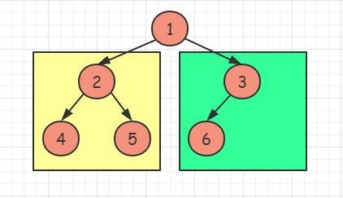

# 222-完全二叉树的节点个数

难度 中等


## 题目描述

给你一棵 完全二叉树 的根节点 `root` ，求出该树的节点个数。

完全二叉树 的定义如下：在完全二叉树中，除了最底层节点可能没填满外，其余每层节点数都达到最大值，并且最下面一层的节点都集中在该层最左边的若干位置。若最底层为第 `h` 层，则该层包含 `1~ 2^h` 个节点。

示例 1：


```
输入：root = [1,2,3,4,5,6]
输出：6
```
示例 2：
```
输入：root = []
输出：0
```
示例 3：
```
输入：root = [1]
输出：1
```

提示：

- 树中节点的数目范围是`[0, 5 * 10^4]`
- `0 <= Node.val <= 5 * 10^4`
- 题目数据保证输入的树是 完全二叉树


进阶：遍历树来统计节点是一种时间复杂度为 O(n) 的简单解决方案。你可以设计一个更快的算法吗？


## 思路

**这是一棵完全二叉树**：除最后一层外，其余层全部铺满；且最后一层向左停靠

- 如果根节点的左子树深度等于右子树深度，则说明**左子树为满二叉树**

  

- 如果根节点的左子树深度大于右子树深度，则说明**右子树为满二叉树**

  

如果知道子树是满二叉树，那么就可以轻松得到该子树的节点数目：`2^depth - 1`, `depth`为子树的深度

接着我们只需要接着对另一子树递归即可


## 代码

```c++
/**
 * Definition for a binary tree node.
 * struct TreeNode {
 *     int val;
 *     TreeNode *left;
 *     TreeNode *right;
 *     TreeNode() : val(0), left(nullptr), right(nullptr) {}
 *     TreeNode(int x) : val(x), left(nullptr), right(nullptr) {}
 *     TreeNode(int x, TreeNode *left, TreeNode *right) : val(x), left(left), right(right) {}
 * };
 */
class Solution {
public:
    int height(TreeNode* root) {
        int res = 0;
        while (root) {
            res++;
            root = root->left;
        }
        return res;
    }
    int countNodes(TreeNode* root) {
        if (root == nullptr) return 0;
        int height_left = height(root->left);
        int height_right = height(root->right);
        if (height_left == height_right) return countNodes(root->right) + pow(2, height_left);
        return countNodes(root->left) + pow(2, height_right);
    }
};
```

