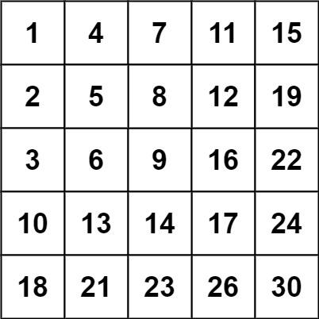

# 240-搜索二维矩阵

难度 中等


## 题目描述

编写一个高效的算法来搜索 `m x n` 矩阵 `matrix` 中的一个目标值 `target` 。该矩阵具有以下特性：

- 每行的元素从左到右升序排列。
- 每列的元素从上到下升序排列。

示例 1：


```
输入：matrix = [[1,4,7,11,15],[2,5,8,12,19],[3,6,9,16,22],[10,13,14,17,24],[18,21,23,26,30]], target = 5
输出：true
```
示例 2：



```
输入：matrix = [[1,4,7,11,15],[2,5,8,12,19],[3,6,9,16,22],[10,13,14,17,24],[18,21,23,26,30]], target = 20
输出：false
```

提示：

- `m == matrix.length`
- `n == matrix[i].length`
- `1 <= n, m <= 300`
- `-10^9 <= matix[i][j] <= 10^9`
- 每行的所有元素从左到右升序排列
- 每列的所有元素从上到下升序排列
- `-10^9 <= target <= 10^9`


## 思路

- 左下角的元素是这一行中最小的元素，同时又是这一列中最大的元素。比较左下角元素和目标：
  - 若左下角元素等于目标，则找到
  - 若左下角元素大于目标，则目标不可能存在于当前矩阵的最后一行，问题规模可以减小为在去掉最后一行的子矩阵中寻找目标
  - 若左下角元素小于目标，则目标不可能存在于当前矩阵的第一列，问题规模可以减小为在去掉第一列的子矩阵中寻找目标
- 若最后矩阵减小为空，则说明不存在


## 代码

```c++
class Solution {
public:
    bool searchMatrix(vector<vector<int>>& matrix, int target) {
        int i = matrix.size() - 1;
        int j = 0;
        while (i >= 0 && j < matrix[0].size()) {
            if (matrix[i][j] == target) return true;
            if (matrix[i][j] > target) i--;
            else j++;
        }
        return false;
    }
};
```

