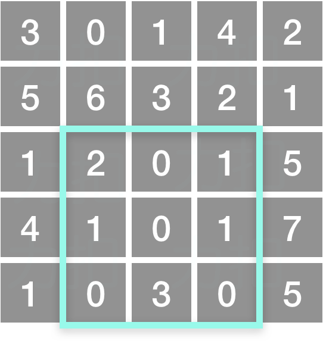

# 304-二维区域和检索-矩阵不可变

难度 中等


## 题目描述

给定一个二维矩阵，计算其子矩形范围内元素的总和，该子矩阵的左上角为 `(row1, col1)` ，右下角为 `(row2, col2)` 。




上图子矩阵左上角 (row1, col1) = (2, 1) ，右下角(row2, col2) = (4, 3)，该子矩形内元素的总和为 8。

示例：
```
给定 matrix = [
  [3, 0, 1, 4, 2],
  [5, 6, 3, 2, 1],
  [1, 2, 0, 1, 5],
  [4, 1, 0, 1, 7],
  [1, 0, 3, 0, 5]
]

sumRegion(2, 1, 4, 3) -> 8
sumRegion(1, 1, 2, 2) -> 11
sumRegion(1, 2, 2, 4) -> 12
```

提示：

- 你可以假设矩阵不可变。
- 会多次调用 `sumRegion` 方法。
- 你可以假设 `row1 ≤ row2` 且 `col1 ≤ col2` 。


## 思路

```
sumRegion(row1, col1, row2, col2) = sums[row2][col2] - sums[row1 - 1][col2] - sums[row2][col1 - 1] + sums[row1 - 1][col1 - 1]
```


## 代码

```c++
class NumMatrix {
public:
    vector<vector<int>> sums;
    NumMatrix(vector<vector<int>>& matrix) {
        int i, j;
        for (i = 0; i < matrix.size(); i++) {
            vector<int> line_sums;
            int sum = 0;
            for (j = 0; j < matrix[0].size(); j++) {
                sum += matrix[i][j];
                if (i == 0) line_sums.push_back(sum);
                else line_sums.push_back(sum + sums[i - 1][j]);
            }
            sums.push_back(line_sums);
        }
    }
    
    int sumRegion(int row1, int col1, int row2, int col2) {
        if (row1 == 0 && col1 == 0) return sums[row2][col2];
        if (row1 == 0) return sums[row2][col2] - sums[row2][col1 - 1];
        if (col1 == 0) return sums[row2][col2] - sums[row1 - 1][col2]; 
        return sums[row2][col2] - sums[row1 - 1][col2] - sums[row2][col1 - 1] + sums[row1 - 1][col1 - 1];
    }
};

/**
 * Your NumMatrix object will be instantiated and called as such:
 * NumMatrix* obj = new NumMatrix(matrix);
 * int param_1 = obj->sumRegion(row1,col1,row2,col2);
 */
```

