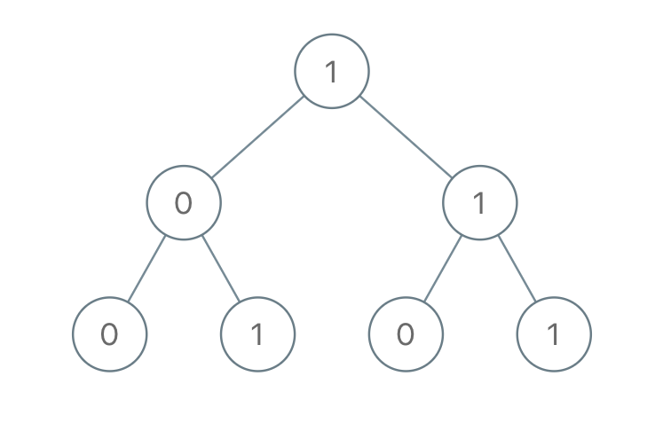

# 1022-从根到叶的二进制数之和

难度 简单


## 题目描述

给出一棵二叉树，其上每个结点的值都是 0 或 1 。每一条从根到叶的路径都代表一个从最高有效位开始的二进制数。例如，如果路径为 `0 -> 1 -> 1 -> 0 -> 1`，那么它表示二进制数 `01101`，也就是 `13` 。

对树上的每一片叶子，我们都要找出从根到该叶子的路径所表示的数字。

以 `10^9 + 7` 为模，返回这些数字之和。

示例：



```
输入：[1,0,1,0,1,0,1]
输出：22
解释：(100) + (101) + (110) + (111) = 4 + 5 + 6 + 7 = 22
```

提示：

树中的结点数介于 1 和 1000 之间。
node.val 为 0 或 1 。


## 思路

遍历二叉树，每次到叶子节点就将目前路径的累加和`currSum`添加到全局的和`sum`中。


## 代码

```c++
/**
 * Definition for a binary tree node.
 * struct TreeNode {
 *     int val;
 *     TreeNode *left;
 *     TreeNode *right;
 *     TreeNode(int x) : val(x), left(NULL), right(NULL) {}
 * };
 */
class Solution {
public:
    int sum = 0;
    int modNum = 1000000000 + 7;
    void helper(TreeNode* root, int currSum){
        currSum = currSum * 2 + root->val;
        if(root->left == NULL && root->right == NULL){
            sum += currSum;
            sum = sum % modNum;
            return;
        }
        if(root->left) helper(root->left, currSum);
        if(root->right) helper(root->right, currSum);
    }
    int sumRootToLeaf(TreeNode* root) {
        helper(root, 0);
        return sum;
    }
};
```

