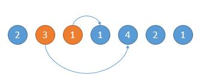

# 45-跳跃游戏II

难度 困难


## 题目描述

给定一个非负整数数组，你最初位于数组的第一个位置。

数组中的每个元素代表你在该位置可以跳跃的最大长度。

你的目标是使用最少的跳跃次数到达数组的最后一个位置。

示例:

```
输入: [2,3,1,1,4]
输出: 2
解释: 跳到最后一个位置的最小跳跃数是 2。
     从下标为 0 跳到下标为 1 的位置，跳 1 步，然后跳 3 步到达数组的最后一个位置。
```


说明:

假设你总是可以到达数组的最后一个位置。


## 思路

动态规划会超时。。。

贪心算法，从起始点开始，每次在可以到达的范围内，选择下一次跳跃可以更远的位置。

如下图，开始的位置是 2，可跳的范围是橙色的。然后因为 3 可以跳的更远，所以跳到 3 的位置。



如下图，然后现在的位置就是 3 了，能跳的范围是橙色的，然后因为 4 可以跳的更远，所以下次跳到 4 的位置。


## 代码

```c++
class Solution {
public:
    int jump(vector<int>& nums) {
        int i, j;
        int steps = 0;
        i = 0;
        while (i < nums.size() - 1) {
            int max_location = 0;
            int max_step = 0;
            if (i + nums[i] >= nums.size() - 1) {
                steps++; 
                break;
            }
            for (j = 1; j <= nums[i]; j++) {
                if (i + j + nums[i + j] > max_location) {
                    max_location = i + j + nums[i + j];
                    max_step = j;
                }
            }
            steps++;
            i = i + max_step;
        }
        return steps;
    }
};
```

