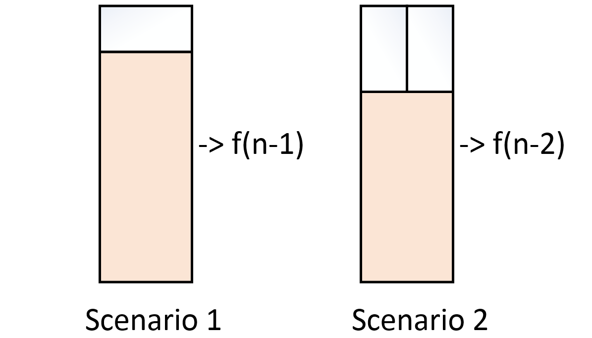

# 010-矩形覆盖


## 题目描述

我们可以用2\*1的小矩形横着或者竖着去覆盖更大的矩形。请问用n个2\*1的小矩形无重叠地覆盖一个2\*n的大矩形，总共有多少种方法？


## 思路

假设：n块矩形有f(n)种覆盖方法。进行逆向分析，要完成最后的搭建有两种可能。



第一种情况等价于情形1中阴影部分的n-1块矩形有多少种覆盖方法，为f(n-1);

第二种情况等价于情形2中阴影部分的n-2块矩形有多少种覆盖方法，为f(n-2); 

故f(n) = f(n-1) + f(n-2)，还是一个斐波那契数列。。。。 

且f(1) = 1, f(2) = 2


## 代码

```c++
class Solution {
public:
    int rectCover(int number) {
        if(number == 0) return 0;
        if(number == 1) return 1;
        if(number == 2) return 2;
        int last1 = 2;
        int last2 = 1;
        int i, result;
        for(i = 3; i <= number; i++){
            result = last1 + last2;
            last2 = last1;
            last1 = result;
        }
        return result;
    }
};
```

